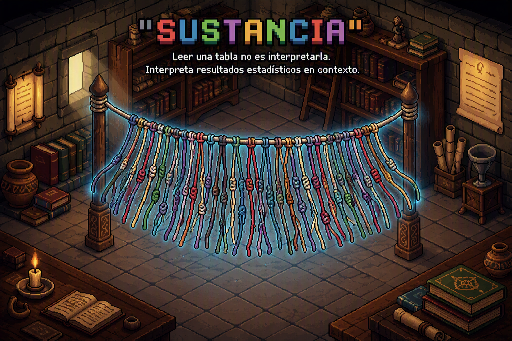

<!-- Video de entrada restaurado: ocupa la ventana completa y termina con su montaje original. -->
```{=html}
<div id="intro-splash" class="s3-intro" aria-label="Presentación audiovisual de Sustancia">
  <video id="intro-video" autoplay muted playsinline preload="auto" poster="assets/portada sustancia.png" aria-label="Video introductorio de Sustancia">
    <source src="video_entrada.mp4" type="video/mp4">
  </video>
  <button type="button" id="btn-saltar-intro" class="s3-skip">Saltar introducción →</button>
</div>
<noscript><style>#intro-splash{display:none!important}</style></noscript>
```

::: {.hero}


<div class="eyebrow">Sustancia · laboratorio de aprendizaje estadístico · en desarrollo</div>

# Leer una tabla no es interpretarla.


<p class="hero-sub"><strong>Sustancia</strong> es un juego web para aprender a interpretar resultados
estadísticos en contexto: sociología, psicología, política pública, salud.
El prototipo actual invita a escribir interpretaciones y recibir retroalimentación. La siguiente etapa explora un diagnóstico inicial, un perfil multidimensional de maestría y actividades que se ajustan al recorrido de aprendizaje.</p>
::: 
<p class="v2-lead"><strong>Aprender estadística es aprender a pensar con los datos.</strong> No basta con encontrar el resultado: también hay que comprenderlo, discutir sus límites y transferir lo aprendido.</p>

<div class="v2-actions"><a href="como-funciona.qmd" class="v2-btn v2-primary">Conoce cómo funcionará →</a><a href="piloto.qmd" class="v2-btn">Explora el prototipo actual ↗</a></div>

## Mira la diferencia {.seccion}

Ambas respuestas describen la misma tabla de un estudio real sobre tecnología y
salud mental en estudiantes de primer año. Solo una de ellas dice algo sobre el mundo.

<table class="demo-tabla">
<caption>Modelo de regresión: deterioro de salud mental (fragmento ilustrativo)</caption>
<thead>
<tr><th>Predictor</th><th>β</th><th>p</th></tr>
</thead>
<tbody>
<tr><td>Uso compulsivo (IDA)</td><td>.38</td><td>&lt; .001</td></tr>
<tr><td>Género (mujer)</td><td>.24</td><td>.002</td></tr>
<tr class="fila-ns"><td>Tiempo de pantalla</td><td>.05</td><td>.41</td></tr>
</tbody>
</table>

::: {.comparacion}
<div class="carta carta-n1">
<span class="nivel-tag">NIVEL 1 · LECTURA TÉCNICA</span>
<p>"El uso compulsivo y el género son significativos (p&nbsp;&lt;&nbsp;.05).
El tiempo de pantalla no es significativo."</p>
<div class="veredicto">✓ Correcto. Pero todavía no dijiste nada sobre el mundo.
<strong>1 punto.</strong></div>
</div>

<div class="carta carta-n3">
<span class="nivel-tag">NIVEL 3 · INTERPRETACIÓN SUSTANTIVA</span>
<p>"El deterioro no se asocia a <em>cuánto</em> tiempo se usa la pantalla,
sino a <em>cómo</em> se usa: es el modo compulsivo, no la exposición, lo que
importa. Una política centrada en limitar horas apuntaría al blanco equivocado."</p>
<div class="veredicto">✓ Interpretación con sustancia: conecta el hallazgo — incluido
el nulo — con el fenómeno y sus implicancias. <strong>4 puntos.</strong></div>
</div>
::: 
## El aprendizaje tiene varias dimensiones {.seccion}

Una respuesta puede ser correcta en el cálculo y débil en interpretación. Otra puede mostrar razonamiento crítico, pero necesitar refuerzo en el procedimiento. Por eso el nuevo modelo de Sustancia busca representar **conceptos, operaciones, profundidad interpretativa, errores y evolución**, sin reducirlos a una única nota.

<div class="v2-card-grid">
  <article class="v2-card"><span class="v2-kicker">01 · CONCEPTOS</span><h3>Qué comprendes</h3><p>Variables, medidas, gráficos, distribuciones y conceptos estadísticos a través de distintos niveles formativos.</p></article>
  <article class="v2-card"><span class="v2-kicker">02 · OPERACIONES</span><h3>Qué puedes hacer</h3><p>Reconocer, describir, calcular, comparar, interpretar, contextualizar, criticar y transferir.</p></article>
  <article class="v2-card"><span class="v2-kicker">03 · INTERPRETACIÓN</span><h3>Hasta dónde profundizas</h3><p>N1 lectura técnica; N2 interpretación estadística; N3 interpretación sustantiva; N4 lectura crítica.</p></article>
  <article class="v2-card"><span class="v2-kicker">04 · TRAYECTORIA</span><h3>Cómo revisas y evolucionas</h3><p>La respuesta inicial, la retroalimentación y la producción revisada pueden aportar nueva evidencia de aprendizaje.</p></article>
</div>

[Explora dos perfiles simulados en el modelo pedagógico →](pedagogia.qmd)

## De la respuesta a la revisión {.seccion}

**Una misma dinámica puede movilizar aprendizajes diferentes.** Elige entre cuatro contextos —ciencias sociales, salud, metodología e ingeniería— y recorre cinco momentos del ciclo. Observa cómo cambia la respuesta cuando el sistema devuelve una pregunta en lugar de entregar una conclusión.

```{=html}
<div class="s3-examples" data-s3-examples>
  <div class="s3-examples-top"><span class="v2-kicker">LABORATORIO · CUATRO CONTEXTOS</span><span class="s3-example-counter" data-s3-example-counter>1 de 5 · ejemplo simulado</span></div>
  <div class="s3-example-choices" role="group" aria-label="Elegir contexto estadístico">
    <button type="button" data-s3-example="ingresos" aria-pressed="true">Ingresos</button>
    <button type="button" data-s3-example="salud" aria-pressed="false">Salud</button>
    <button type="button" data-s3-example="encuestas" aria-pressed="false">Encuestas</button>
    <button type="button" data-s3-example="ingenieria" aria-pressed="false">Ingeniería</button>
  </div>
  <div class="s3-example-timeline" role="group" aria-label="Explorar el ciclo de aprendizaje">
    <button type="button" data-s3-stage="0" aria-pressed="true">1. Desafío</button>
    <button type="button" data-s3-stage="1" aria-pressed="false">2. Producción</button>
    <button type="button" data-s3-stage="2" aria-pressed="false">3. Feedback</button>
    <button type="button" data-s3-stage="3" aria-pressed="false">4. Revisión</button>
    <button type="button" data-s3-stage="4" aria-pressed="false">5. Evidencia</button>
  </div>
  <div class="s3-example-panel" aria-live="polite">
    <span class="v2-kicker" data-s3-example-role>Consigna del juego</span>
    <h3 data-s3-example-heading>Ingresos y valores extremos · Ciencias sociales</h3>
    <p data-s3-example-text>En una comuna la media de ingresos es muy superior a la mediana. ¿Qué significa?</p>
    <button type="button" class="s3-next" data-s3-example-next>Ver el siguiente momento →</button>
  </div>
  <p class="v2-small">Ejemplos hipotéticos para entender el modelo; no son conversaciones reales ni demuestran eficacia. El estudiante produce la respuesta, no la IA.</p>
</div>
```

## Cómo funcionará {.seccion}

El diseño adaptativo proyecta un **diagnóstico inicial**, la estimación de un **vector de maestría**, la selección de actividades curriculares y un ciclo de revisión guiada. El estudiante comienza jugando a partir de desafíos propuestos por el sistema; **no necesita subir documentos**. Las fuentes y ejercicios son curados por el equipo académico.

<div class="v2-actions"><a class="v2-btn v2-primary" href="como-funciona.qmd">Sigue el recorrido del estudiante →</a><a class="v2-btn" href="universidades.qmd">Aplicación universitaria →</a></div>

## Marco {.seccion}

```{=html}
<div class="marco-layout">
  <div class="marco-texto">
    <div class="cita-marco">La apuesta epistemológica se inspira en Gilbert Simondon: aprender estadística no consiste solo en ejecutar técnicas, sino en comprender las decisiones que producen los resultados, sus supuestos y aquello que no permiten afirmar.</div>
  </div>
  <div class="marco-video">
    <video autoplay loop muted playsinline class="video-chico" aria-label="Video ilustrativo del proyecto">
      <source src="maya.mp4" type="video/mp4">
      Tu navegador no soporta videos.
    </video>
  </div>
</div>
```

El corpus inicial del prototipo proviene de investigación empírica sobre habitus tecnológico y salud mental en estudiantes universitarios de primer año (*n* = 276). La propuesta formativa se amplía ahora hacia materiales y experiencias de estadística en diferentes campos.

## Estado del proyecto {.seccion}

No todas las piezas de Sustancia están disponibles al mismo tiempo. Estas etiquetas separan lo que ya se puede explorar de lo que estamos diseñando.

```{=html}
<div class="s3-status-grid">
  <article class="s3-status"><span class="s3-badge s3-now">EXISTENTE</span><h3>Prototipo en Shiny</h3><p>Actividades de interpretación y una propuesta inicial de evaluación formativa.</p></article>
  <article class="s3-status"><span class="s3-badge s3-now">DOCUMENTADO</span><h3>Marco pedagógico</h3><p>Taxonomía de errores, N1–N4 y fundamento teórico del proyecto.</p></article>
  <article class="s3-status"><span class="s3-badge s3-next-state">EN DESARROLLO</span><h3>Vector de maestría</h3><p>Diagnóstico inicial y perfil multidimensional sustentado en evidencias.</p></article>
  <article class="s3-status"><span class="s3-badge s3-next-state">PROYECTADO</span><h3>Adaptación y seguimiento</h3><p>Conversaciones recursivas, selección de actividades y paneles para docentes e instituciones.</p></article>
</div>
```

[Conocer la fundamentación →](fundamentacion.qmd) · [Explorar el modelo pedagógico →](pedagogia.qmd)

```{=html}
<script src="assets/sustancia-interactions.js" defer></script>
```
